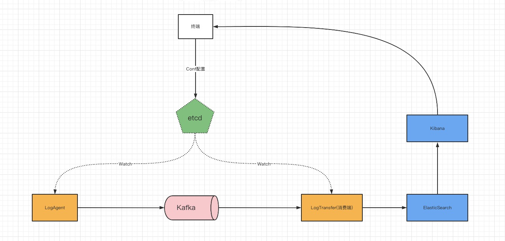

# Logagent

### 项目目的
学习熟悉Golang语言，主要练习Golang中Channel、Context、goroutine相关知识点。上述为学习视频地址

### 项目环境
> 操作系统： MacOs M1 arm64 \
> Golang版本： go version go1.17.2 darwin/arm64 
> 

### 项目架构图

### 部署方式
> 此项目所用到的组件都为docker，如需在非arm64系统上部署，更换对应系统的镜像即可 \
> docker中network创建方式：\
> `docker network create --driver bridge --subnet 172.16.0.0/16 --gateway 172.16.0.1 kafka` \
> 
> docker启动方式：\
> `docker-compose up -d`